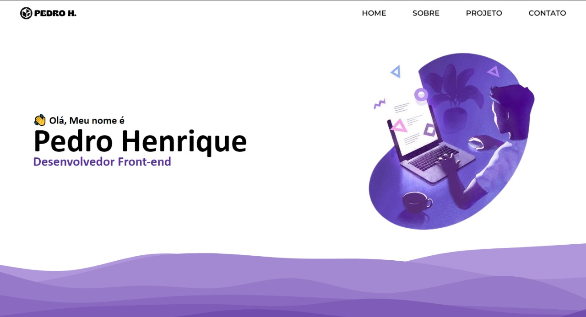

# Meu Portfólio

Bem-vindo ao meu portfólio! Este é o meu primeiro projeto um pouco mais detalhado e estou empolgado para compartilhar com vocês.

## Descrição

Este projeto é uma coleção dos meus estudos. Ele foi desenvolvido com o objetivo de mostrar minhas capacidades como desenvolvedor e meu progresso ao longo do tempo.

## Funcionalidades

- **Sobre Mim:** Uma seção detalhada sobre minhas habilidades.
- **Projetos:** Uma galeria dos meus futuros projetos com descrições e links para o código fonte.
- **Contato:** Um formulário de contato para que visitantes possam entrar em contato comigo.

## Tecnologias Utilizadas

- **HTML5:** Estrutura do site.
- **CSS3:** Estilização das páginas.

## Desafios e Aprendizados

Este foi meu primeiro projeto utilizando HTML e CSS. Enfrentei alguns desafios ao criar layouts e ao entender como posicionar elementos de forma correta. No entanto, esses desafios me ajudaram a aprender muito sobre desenvolvimento web e melhorar minhas habilidades.

## Próximos Passos

Pretendo continuar aprimorando meu portfólio à medida que aprendo novas tecnologias e habilidades. Meus próximos objetivos incluem:

- Aprender JavaScript para adicionar interatividade ao meu site.
- Explorar frameworks CSS como Bootstrap para melhorar o design e a responsividade.
- Criar e incluir novos projetos à medida que ganho mais experiência.

---

Qualquer feedback ou sugestão é bem-vindo. Obrigado por visitar meu portfólio!

